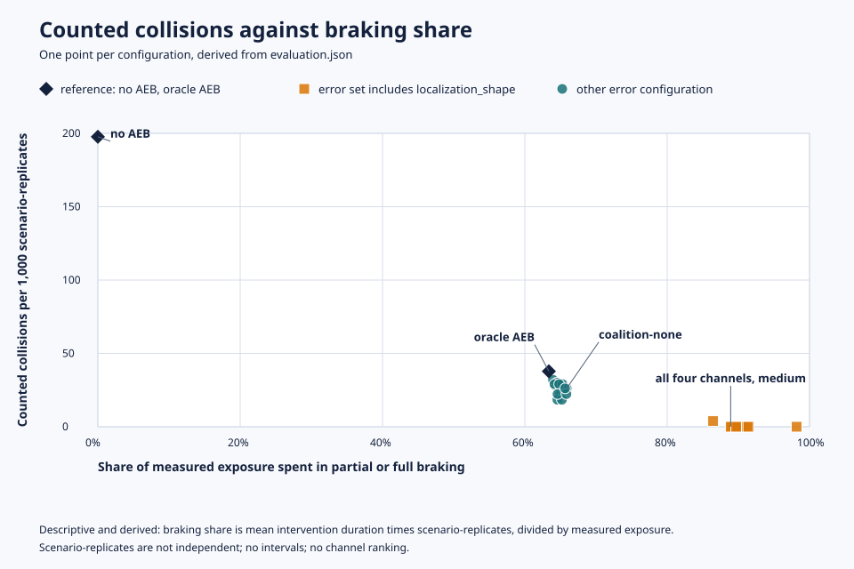

# perception-error-to-aeb

**在同一批 nuPlan 場景與固定 AEB policy 下，dropout、定位與形狀誤差、延遲及 track instability 會如何傳遞成碰撞與煞車行為？**

[English](README.en.md) · [線上報告](https://kuotunyu.github.io/perception-error-to-aeb/) · [v1.0.0 發布](https://github.com/kuotunyu/perception-error-to-aeb/releases/tag/v1.0.0) · [證據導覽](docs/README.md)

[](https://github.com/kuotunyu/perception-error-to-aeb/actions/workflows/ci.yml) [](https://github.com/kuotunyu/perception-error-to-aeb/actions/workflows/pages.yml)

## 主要發現

- **觀察：** 計入碰撞從無 AEB 的 `collisions` = 204 <!-- claim: p3.baseline.collisions.no_aeb -->，降到 oracle AEB 的 `collisions` = 39 <!-- claim: p3.baseline.collisions.oracle_aeb -->（另有 `contacts_not_at_fault` = 1095 <!-- claim: p3.baseline.contacts_not_at_fault.oracle_aeb --> 個排除接觸），再到同時注入四種 medium 感知誤差時的 `collisions` = 0 <!-- claim: p3.coalition.collisions.coalition-dropout-localization_shape-latency-track_instability -->。以 oracle AEB 為對照，這個設定有 `false_interventions` = 4881 <!-- claim: p3.coalition.false_interventions.coalition-dropout-localization_shape-latency-track_instability --> 個誤煞與 `missed_interventions` = 2685 <!-- claim: p3.coalition.missed_interventions.coalition-dropout-localization_shape-latency-track_instability --> 個漏煞事件，每個 scenario-replicate 平均煞車 `mean_intervention_duration_s` = 13.3 <!-- claim: p3.coalition.mean_intervention_duration_s.coalition-dropout-localization_shape-latency-track_instability; rounded: 1 --> 秒；oracle AEB 則是 `mean_intervention_duration_s` = 9.2 <!-- claim: p3.baseline.mean_intervention_duration_s.oracle_aeb; rounded: 1 --> 秒。
- **為何重要：** 只看計入碰撞，會獎勵煞得更多的 AEB：本研究中計入碰撞最少的設定，正是煞車時間占實測曝光比例最高的設定，而不是感知較好的設定。因此評估感知誤差時，碰撞與煞車決策錯誤必須一起看，也就是 SOTIF 所關注的誤觸發與漏觸發取捨；本研究不主張符合任何標準。機制說明見[已知的控制器與建模選擇](docs/simulation-contract.md#known-controller-and-modelling-choices)。
- **這個 repository 展示的內容：** 以 nuPlan 記錄場景進行閉環故障注入、四個誤差 channel 在 medium 嚴重度下開／關的完整因子設計（共十六種組合）與精確 Shapley 值、由 CI 對照 claims registry 核對的 README 與發布說明結果數值、以 digest 固定的 container、完整的 statement 與 branch coverage，以及留有紀錄的 mutation audit。



此圖為描述性的衍生圖，由 `aeb-risk figures` 從 `evaluation.json` 產生。scenario-replicates 不是獨立樣本，圖中沒有信賴區間，也不支持 channel 排名。

### Finding (English)

- **Observed.** Counted collisions go from `collisions` = 204 <!-- claim: p3.baseline.collisions.no_aeb --> without AEB to `collisions` = 39 <!-- claim: p3.baseline.collisions.oracle_aeb --> with oracle AEB, which also records `contacts_not_at_fault` = 1095 <!-- claim: p3.baseline.contacts_not_at_fault.oracle_aeb --> excluded contacts, and to `collisions` = 0 <!-- claim: p3.coalition.collisions.coalition-dropout-localization_shape-latency-track_instability --> with all four medium perception errors injected. That configuration also records `false_interventions` = 4881 <!-- claim: p3.coalition.false_interventions.coalition-dropout-localization_shape-latency-track_instability --> false and `missed_interventions` = 2685 <!-- claim: p3.coalition.missed_interventions.coalition-dropout-localization_shape-latency-track_instability --> missed braking events relative to oracle AEB, and brakes for `mean_intervention_duration_s` = 13.3 <!-- claim: p3.coalition.mean_intervention_duration_s.coalition-dropout-localization_shape-latency-track_instability; rounded: 1 --> s per scenario-replicate on average, against `mean_intervention_duration_s` = 9.2 <!-- claim: p3.baseline.mean_intervention_duration_s.oracle_aeb; rounded: 1 --> s for oracle AEB.
- **Why it matters.** Counted collisions alone reward an AEB that brakes more: here the configurations with the fewest counted collisions are the ones that spend the largest share of their measured exposure braking, not the ones with better perception. Perception faults therefore have to be judged on collisions and braking-decision errors together, the unintended-versus-missed activation trade-off that SOTIF addresses; this study makes no compliance claim. See the [English README](README.en.md).
- **What the repository shows.** Closed-loop fault injection on logged nuPlan scenarios, the full on/off factorial of the four error channels at medium severity (all sixteen combinations) with exact Shapley values, README and release-note result values that CI checks against a claims registry, a digest-pinned container, full statement and branch coverage, and a recorded mutation audit.

這個研究不訓練模型。它固定場景、初始狀態、路徑、名義控制器、模擬頻率與終止規則，只改變 AEB 收到的觀測。v1.0.0 收錄完成的正式模擬、衍生證據與資料獨立的重現工具。

## 觀察結果

共同有效 cohort 的 `common_valid_tokens` = 344。<!-- claim: p3.evaluation.common_valid_tokens --> 每個設定都使用同一批 token；表內的 scenario-replicates 是重複執行，不是獨立樣本。

| 設定 | Scenario-replicates | 計入碰撞 | `contacts_not_at_fault` | 實測曝光（秒） |
| --- | ---: | ---: | ---: | ---: |
| no AEB | `scenarios` = 1032 <!-- claim: p3.baseline.scenarios.no_aeb --> | `collisions` = 204 <!-- claim: p3.baseline.collisions.no_aeb --> | `contacts_not_at_fault` = 261 <!-- claim: p3.baseline.contacts_not_at_fault.no_aeb --> | `simulated_seconds` = 10945.5 <!-- claim: p3.baseline.simulated_seconds.no_aeb --> |
| oracle AEB | `scenarios` = 1032 <!-- claim: p3.baseline.scenarios.oracle_aeb --> | `collisions` = 39 <!-- claim: p3.baseline.collisions.oracle_aeb --> | `contacts_not_at_fault` = 1095 <!-- claim: p3.baseline.contacts_not_at_fault.oracle_aeb --> | `simulated_seconds` = 14901.9 <!-- claim: p3.baseline.simulated_seconds.oracle_aeb; rounded: 1 --> |
| 空 coalition `coalition-none` | `scenarios` = 1032 <!-- claim: p3.coalition.scenarios.coalition-none --> | `collisions` = 27 <!-- claim: p3.coalition.collisions.coalition-none --> | `contacts_not_at_fault` = 1149 <!-- claim: p3.coalition.contacts_not_at_fault.coalition-none --> | `simulated_seconds` = 15043.5 <!-- claim: p3.coalition.simulated_seconds.coalition-none; rounded: 1 --> |
| 全通道 medium coalition | `scenarios` = 1032 <!-- claim: p3.coalition.scenarios.coalition-dropout-localization_shape-latency-track_instability --> | `collisions` = 0 <!-- claim: p3.coalition.collisions.coalition-dropout-localization_shape-latency-track_instability --> | `contacts_not_at_fault` = 1150 <!-- claim: p3.coalition.contacts_not_at_fault.coalition-dropout-localization_shape-latency-track_instability --> | `simulated_seconds` = 15395.8 <!-- claim: p3.coalition.simulated_seconds.coalition-dropout-localization_shape-latency-track_instability --> |

同時看煞車代價：下表的 false/missed 是事件數，不是獨立場景數，可能超過 scenario-replicates。no AEB 的兩欄依契約記為零，不能解讀成沒有漏煞車；[研究卡](docs/experiment-card.md)說明比較方式。

| 設定 | 平均介入時間（秒） | False events | Missed events |
| --- | ---: | ---: | ---: |
| no AEB | `mean_intervention_duration_s` = 0.0 <!-- claim: p3.baseline.mean_intervention_duration_s.no_aeb --> | `false_interventions` = 0 <!-- claim: p3.baseline.false_interventions.no_aeb --> | `missed_interventions` = 0 <!-- claim: p3.baseline.missed_interventions.no_aeb --> |
| oracle AEB | `mean_intervention_duration_s` = 9.2 <!-- claim: p3.baseline.mean_intervention_duration_s.oracle_aeb; rounded: 1 --> | `false_interventions` = 0 <!-- claim: p3.baseline.false_interventions.oracle_aeb --> | `missed_interventions` = 0 <!-- claim: p3.baseline.missed_interventions.oracle_aeb --> |
| 空 coalition `coalition-none` | `mean_intervention_duration_s` = 9.6 <!-- claim: p3.coalition.mean_intervention_duration_s.coalition-none; rounded: 1 --> | `false_interventions` = 2577 <!-- claim: p3.coalition.false_interventions.coalition-none --> | `missed_interventions` = 1209 <!-- claim: p3.coalition.missed_interventions.coalition-none --> |
| 全通道 medium coalition | `mean_intervention_duration_s` = 13.3 <!-- claim: p3.coalition.mean_intervention_duration_s.coalition-dropout-localization_shape-latency-track_instability; rounded: 1 --> | `false_interventions` = 4881 <!-- claim: p3.coalition.false_interventions.coalition-dropout-localization_shape-latency-track_instability --> | `missed_interventions` = 2685 <!-- claim: p3.coalition.missed_interventions.coalition-dropout-localization_shape-latency-track_instability --> |

Shapley 的 collision game 中，localization/shape 的觀察平均貢獻為 `collision_indicator` = -0.0274。<!-- claim: p3.shapley.collision_indicator-values-localization_shape; rounded: 4 -->

Shapley 的 intervention-duration game 中，同一 channel 的觀察平均貢獻為 `intervention_duration_s` = 4.07 秒。<!-- claim: p3.shapley.intervention_duration_s-values-localization_shape; rounded: 2 -->

<details>
<summary>捨入前的完整數值</summary>

秒數顯示到小數點後一位，Shapley 貢獻顯示三位有效數字；attribution audit 會從對應 claim 重新計算每個捨入值。完整數值如下：

- oracle AEB：`simulated_seconds` = 14901.900000000001 <!-- claim: p3.baseline.simulated_seconds.oracle_aeb -->
- 空 coalition：`simulated_seconds` = 15043.500000000002 <!-- claim: p3.coalition.simulated_seconds.coalition-none -->
- oracle AEB：`mean_intervention_duration_s` = 9.150872093023263 <!-- claim: p3.baseline.mean_intervention_duration_s.oracle_aeb -->
- 空 coalition：`mean_intervention_duration_s` = 9.603197674418631 <!-- claim: p3.coalition.mean_intervention_duration_s.coalition-none -->
- 全通道 medium coalition：`mean_intervention_duration_s` = 13.265503875969005 <!-- claim: p3.coalition.mean_intervention_duration_s.coalition-dropout-localization_shape-latency-track_instability -->
- Shapley collision game，localization/shape：`collision_indicator` = -0.027374031007751935 <!-- claim: p3.shapley.collision_indicator-values-localization_shape -->
- Shapley intervention-duration game，localization/shape：`intervention_duration_s` = 4.0670219638242875 <!-- claim: p3.shapley.intervention_duration_s-values-localization_shape -->

</details>

這兩個值使用不同單位與尺度，只是 full-minus-empty `coalition-none` 的觀察平均分解，不能相加、比較高低或解讀成顯著性。零嚴重度 tracker 仍以位置差分估計速度，因此 `coalition-none` 不是 oracle。現有證據沒有 Shapley 或設定差值的信賴區間，也不支持 channel 排名。

`bicycle_or_vru` 的 `valid_tokens` = 44 <!-- claim: p3.family-interventions.bicycle_or_vru.oracle_aeb.valid_tokens -->，低於 protocol 的 `evaluation_per_family` = 100。<!-- claim: p3.family-interventions.evaluation_per_family --> 這兩個值只說明樣本不足，不是 efficacy claim；首頁不對該 family 的介入率提出正式結論。

## 圖表與情境重播

初次閱讀可先比較下表同一 family 的 oracle、empty coalition、full medium coalition。將各頁拖到相同時間，觀察 Ego 的速度、AEB 狀態、TTC 與周圍軌跡，再回看上方整體結果中的碰撞、接觸與介入代價。TTC 無可用數值不代表沒有風險。

這些例子依預先固定的 median-nearest 規則選取，適合解釋機制，不能用單一畫面證明整體效果。Zero counted collisions 也不能脫離接觸分類與煞車代價單獨閱讀。

- [計入碰撞與煞車時間占比](docs/figures/collisions-vs-braking.svg)（即主要發現下方的圖）把 no AEB 與 oracle 兩個參考點放在每個誤差設定旁邊。
- [單通道 severity sensitivity](docs/figures/error-severity-sensitivity.svg)依固定嚴重度比較碰撞率、false/missed 事件率與介入時間；各指標分開尺度，使用各設定的實測曝光與 replicate 分母。
- [Shapley 觀察平均貢獻](docs/figures/shapley-contributions.svg)把 collision indicator 與 intervention duration 分成不同單位的 panel。
- [各 family 介入事件率](docs/figures/intervention-rates-by-family.svg)以 scenario-replicates 為分母，沒有借用全體 cohort 的 bootstrap error bar。
- 預先固定的 median-nearest 展示各有 oracle、empty coalition 與 full coalition 的 replicate-zero 版本：

每個重播都是放在線上報告網站上的獨立 HTML 頁面，大小 7.5 至 11.7 MB，建議使用桌機瀏覽器。

| Family | Oracle | Empty coalition | Full medium coalition |
| --- | --- | --- | --- |
| lead/stopping | [開啟](https://kuotunyu.github.io/perception-error-to-aeb/replays/lead_or_stopping--oracle_aeb.html) | [開啟](https://kuotunyu.github.io/perception-error-to-aeb/replays/lead_or_stopping--coalition-none.html) | [開啟](https://kuotunyu.github.io/perception-error-to-aeb/replays/lead_or_stopping--coalition-dropout+localization_shape+latency+track_instability.html) |
| cut-in/crossing | [開啟](https://kuotunyu.github.io/perception-error-to-aeb/replays/cut_in_or_crossing--oracle_aeb.html) | [開啟](https://kuotunyu.github.io/perception-error-to-aeb/replays/cut_in_or_crossing--coalition-none.html) | [開啟](https://kuotunyu.github.io/perception-error-to-aeb/replays/cut_in_or_crossing--coalition-dropout+localization_shape+latency+track_instability.html) |
| pedestrian/crosswalk | [開啟](https://kuotunyu.github.io/perception-error-to-aeb/replays/pedestrian_or_crosswalk--oracle_aeb.html) | [開啟](https://kuotunyu.github.io/perception-error-to-aeb/replays/pedestrian_or_crosswalk--coalition-none.html) | [開啟](https://kuotunyu.github.io/perception-error-to-aeb/replays/pedestrian_or_crosswalk--coalition-dropout+localization_shape+latency+track_instability.html) |
| bicycle/VRU | [開啟](https://kuotunyu.github.io/perception-error-to-aeb/replays/bicycle_or_vru--oracle_aeb.html) | [開啟](https://kuotunyu.github.io/perception-error-to-aeb/replays/bicycle_or_vru--coalition-none.html) | [開啟](https://kuotunyu.github.io/perception-error-to-aeb/replays/bicycle_or_vru--coalition-dropout+localization_shape+latency+track_instability.html) |

重播是從指定 replicate 重新建構的衍生 timeline，使用 scenario-local 原點與匿名 actor ID；它不是 raw trajectory export、地圖畫面或 nuBoard log。每個重建結果先與凍結 formal record 共有的碰撞、接觸、曝光與介入量測逐項比對；formal schema 不保存最終 pose 或 speed，兩者改以同一次 fresh simulator outcome 檢查。

## 解釋邊界

碰撞分類會排除 ego 已停止，或位於 ego 後方且物件速度大小較大的接觸。這是研究內的 operational rule，不是 longitudinal closing-velocity 判定、完整 nuPlan 等價證明或法律責任認定。零個計入碰撞不等於零接觸、較佳感知或實車安全。

評估框架在解讀煞車結果時，找出固定控制器中影響這些數字的幾項特性：AEB 會對必要減速度最高的追蹤物件煞車，不論該物件是否在 ego 的路徑上；名義控制器不會為其他用路人減速；追蹤速度來自含雜訊位置的差分。在已發布的結果中，計入碰撞最少的設定，正是煞車時間占實測曝光比例最高的設定。詳見[已知的控制器與建模選擇](docs/simulation-contract.md#known-controller-and-modelling-choices)與[如何解讀煞車數字](docs/experiment-card.md#reading-the-braking-numbers)。

這些量測與 SOTIF、AEB 測試規程、安全績效指標及既有研究的對應關係，見[與標準及既有研究的關係](docs/experiment-card.md#relation-to-standards-and-prior-work)；該段僅供對照，不主張符合任何標準。

protocol 要求的 maximum horizon 是 15 秒上限；到碰撞、路徑結束、資料結束或上限即停止，所以表中逐設定列實測曝光。logged actors 不會對 ego 反應。本版沒有 sensor pixels、地圖畫面、nuBoard log、每距離碰撞率，也只測一種固定 AEB policy。每 100 km 碰撞率為未提供。

## 重現

所有 Python 指令都在固定的 Linux container 中執行：

```powershell
$env:NUPLAN_DATA_ROOT='D:/datasets/nuplan'
docker compose run --rm dev uv run --frozen aeb-risk summarize-families --results-dir artifacts/formal/nuplan_aeb_v2 --manifest artifacts/manifests/nuplan_aeb_v2/evaluation.json --protocol configs/protocols/nuplan_aeb_v2.yaml --output-dir docs/evidence/nuplan_aeb_v2
docker compose run --rm dev uv run --frozen aeb-risk figures --evidence-dir docs/evidence/nuplan_aeb_v2 --output-dir docs/figures
docker compose run --rm dev uv run --frozen aeb-risk report --claims docs/claims.yaml --artifacts-dir docs/evidence/nuplan_aeb_v2 --output-dir site
docker compose run --rm dev uv run --frozen python -m aebrisk.dev verify
```

完整 provenance、hash 與解釋限制見[分析重現紀錄](docs/verification/analysis-reproduction.md)。資料受 nuPlan/Motional 條款與 [CC BY-NC-SA 4.0](docs/evidence/nuplan_aeb_v2-NOTICE.md) 規範；原始碼使用 MIT license。

同一 portfolio 的 [P1 driving-risk-metrics](https://github.com/kuotunyu/driving-risk-metrics)提供評估與不確定性工具；[P2 bev-calibration-lab](https://github.com/kuotunyu/bev-calibration-lab)研究相機/LiDAR calibration fault，已發布 v1.0.0。三案使用不同資料集與研究設定；這個研究脈絡與描述性資料互通，不代表已驗證同一套模型從感知驅動 AEB。
